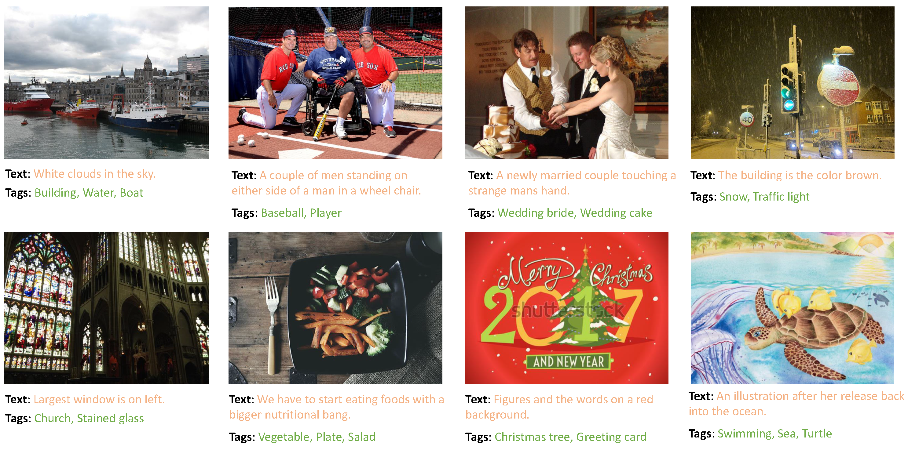

# IDEA: Increasing Text Diversity via Online Multi-Label Recognition for Vision-Language Pre-training

## Introduction

Official PyTorch Implementation of the paper [IDEA: Increasing Text Diversity via Online Multi-Label Recognition for Vision-Language Pre-training
](https://arxiv.org/abs/2207.05333)

> Xinyu Huang, Youcai Zhang, Ying Cheng, Weiwei Tian, Ruiwei Zhao, Rui Feng*, Yuejie Zhang*, Yaqian Li, Yandong Guo, Xiaobo Zhang*
> <br/> Fudan University, OPPO Research Institute, Shanghai Key Laboratory of Intelligent Information Processing


**Abstract**

Training vision-language models with image-text pairs co-occurrent on the Internet is suboptimal, as such supervision typically lacks explicit alignment information. We propose IDEA to provide more explicit supervision (including multiple valuable tags and texts composed by multiple tags). Our IDEA jointly trains multi-label recognition with tags from texts and identifies additional tags online.

<p align="center">
 <table class="tg">
  <tr>
    <td class="tg-c3ow"></td>
  </tr>
</table>
</p>

**Example results**

Text refers to the original co-occurrent texts with the image. Tags refer to the identified tags by IDEA, including objects, scenes, attributes, actions, etc. These image tags are entirely learned from the texts and recognized online.
<p align="center">
 <table class="tg">
  <tr>
    <td class="tg-c3ow"></td>
  </tr>
</table>
</p>


## Credit to previous work
This repository is built upon the amazing code base of [ALBEF](https://github.com/salesforce/ALBEF), [CLIP](https://github.com/openai/CLIP) and [ML-decoder](https://github.com/Alibaba-MIIL/ML_Decoder), thanks very much!

## Dataset
Our IDEA jontly trains multi-label recognition with the tags extracted from the text according to the tag list. We provide an example of training json file with VG&COCO dataset in [configs/vg_coco.json](./configs/vg_coco.json) and the tag list is in [dataset/class_config.py](./dataset/class_config.py). Please change the data path in [configs/vg_coco.json](./configs/vg_coco.json) to your own path of the file before training. 


You can also build your own tag list and use other extraction methods. You can prepare custom dataset json file where each json file contains a list. Each item in the list is a dictonary with three key-value pairs: {'image': path_of_image, 'caption': text_of_image, 'tag': tags_from_text}. In [configs/Pretrain.yaml](./configs/Pretrain.yaml), set the paths for the json files.


## Training Code


Pre-train the model of IDEA using 8 V100 GPUs:
```python
python -m torch.distributed.launch --nproc_per_node=8 --use_env Pretrain.py --config ./configs/Pretrain.yaml --output_dir output/idea/ --model idea
```

Pre-train the model of CLIP using 8 V100 GPUs:
```python
python -m torch.distributed.launch --nproc_per_node=8 --use_env Pretrain.py --config ./configs/Pretrain.yaml --output_dir output/clip/ --model clip
```

## Zero-Shot Evaluation
```
python evaluation.py --checkpoint_path {path to model for evaluation} --dataset {path to ImageNet validaion set}
```


## Citation
If you find this repository to be useful for your research, please consider citing.
```
@article{huang2022idea,
  title={IDEA: Increasing Text Diversity via Online Multi-Label Recognition for Vision-Language Pre-training},
  author={Huang, Xinyu and Zhang, Youcai and Cheng, Ying and Tian, Weiwei and Zhao, Ruiwei and Feng, Rui and Zhang, Yuejie and Li, Yaqian and Guo, Yandong and Zhang, Xiaobo},
  journal={arXiv preprint arXiv:2207.05333},
  year={2022}
}
